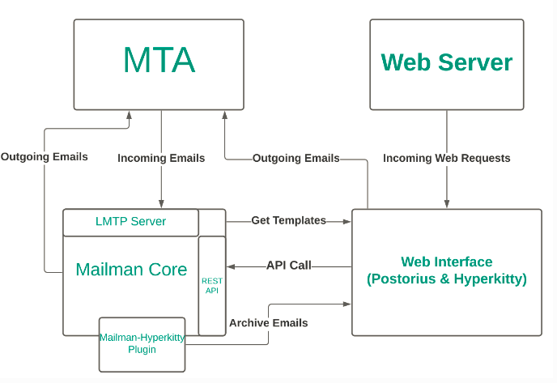

# MAILMAN:

## 项目介绍

​	本项目负责管理邮件列表的源码和相关构建任务，架构设计如下：

## 服务介绍：

+ mailman-web: 主要是web服务，负责与人打交道。

+ mailman-core: 主要是对发送的邮件列表进行处理，负责与邮件列表打交道。

+ mailman-exim: 主要是负责邮件的传递，负责与邮件打交道。

  ~~~bash
  mailman-exim: 在openEuler上构建exim-4.96版本。
  ~~~

  

