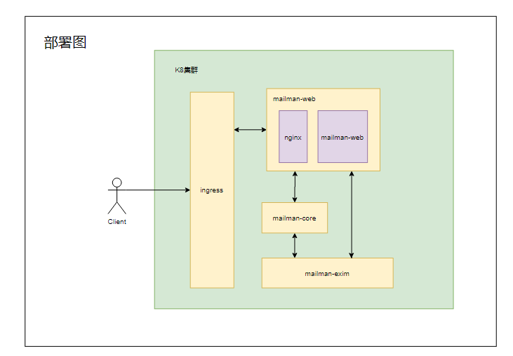

# MAILMAN:

## 项目介绍

​	本项目负责管理邮件列表的源码和相关构建任务，架构设计如下：

## 服务介绍：

+ mailman-web: 主要是web服务，负责与人打交道，主要是架构图中的Web Interface。
+ mailman-core: 主要是对发送的邮件列表进行处理，负责与邮件列表打交道， 主要是架构图的Mailman Core。
+ mailman-exim: 主要是负责邮件的传递，负责与邮件打交道， 主要是架构图中的MTA。

## 安装部署:

## 升级流程：

1.数据备份:先对mailman-web, mailman-core, mailman-exim做快照备份处理，以防升级失败，可以快速恢复。

2.处理邮件列表的subscription requests和held messages

3.处理完后停止exim服务

4.升级mailman-web服务

5.升级mailman-core服务

6.升级mailman-exim服务

7.设置模板, 详细见： [设置模板](https://github.com/opensourceways/mailman/blob/main/mailman-core/README)

8.按照下面测试用例进行测试。

## 测试用例：

详细测试用例见: [测试用例](https://github.com/opensourceways/mailman/blob/main/doc/%E9%82%AE%E4%BB%B6%E5%88%97%E8%A1%A8%E7%9A%84%E6%B5%8B%E8%AF%95%E7%94%A8%E4%BE%8B.xlsx)

