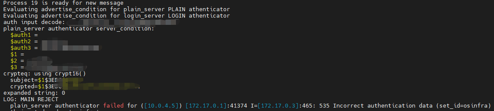
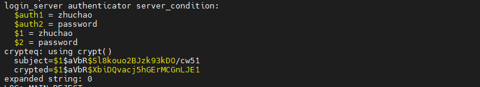
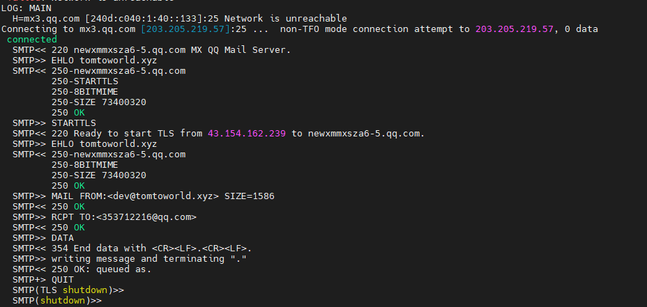

# 1.exim升级到4.95记录

## 1.问题处理

### 1.mailman对接exim4.95版本在login_server报：(535, b'Incorrect authentication data')

解决方法：

1.错误实践（它山之石）： 
		在配置中屏蔽server_conditon， 因为是判断server_condtion不满足条件导致报错，所以直接屏蔽，导致外网用户直接可以使用错误的用户名和密码登录进来，使用我们的exim发送邮件，存在一定风险，该风险因测试不足导致出现，所以此方法严重不可取。

~~~YAML
login_server:
  driver = plaintext
  public_name = LOGIN
  server_prompts = "Username:: : Password::"
  # server_condition = true
  server_condition = "${if crypteq{$auth2}{${extract{1}{:}{${lookup{$auth1}lsearch{CONFDIR/passwd}{$value}{*:*}}}}}{1}{0}}"
  server_set_id = $auth1
  .ifndef AUTH_SERVER_ALLOW_NOTLS_PASSWORDS
  server_advertise_condition = ${if eq{$tls_in_cipher}{}{}{*}}
  .endif
~~~

2.正确实践： 
		分析exim的dockerfile发现， 之前的用户认证加密方式是使用的crypt算法，而最新exim4.95中的dockerfile则是默认使用crypt16算法，导致密码经crypt16计算后和原始密文不一致，从而出现mailman报535_incorrect authentication data。

crypt16的认证日志截图：

以下截图为失败时截图，只有失败才会输出打印，其中： crypteq： using crypt16()则是使用crypt16算法认证。

crypt的认证日志截图：
以下截图为失败时截图，只有失败才会输出打印，其中： crypteq： using crypt则是使用crypt算法认证。

解决方法：编译的时候注释：# DEFAULT_CRYPT=crypt16， 采取默认的加密方法: crypt; 详细解释如下：

~~~bash
#------------------------------------------------------------------------------
# The passwords for user accounts are normally encrypted with the crypt()
# function. Comparisons with encrypted passwords can be done using Exim's
# "crypteq" expansion operator. (This is commonly used as part of the
# configuration of an authenticator for use with SMTP AUTH.) At least one
# operating system has an extended function called crypt16(), which uses up to
# 16 characters of a password (the normal crypt() uses only the first 8). Exim
# supports the use of crypt16() as well as crypt() but note the warning below.

# You can always indicate a crypt16-encrypted password by preceding it with
# "{crypt16}". If you want the default handling (without any preceding
# indicator) to use crypt16(), uncomment the following line:

# DEFAULT_CRYPT=crypt16

# If you do that, you can still access the basic crypt() function by preceding
# an encrypted password with "{crypt}". For more details, see the description
# of the "crypteq" condition in the manual chapter on string expansions.

# Some operating systems do not include a crypt16() function, so Exim has one
# of its own, which it uses unless HAVE_CRYPT16 is defined. Normally, that will
# be set in an OS-specific Makefile for the OS that have such a function, so
# you should not need to bother with it.

# *** WARNING *** WARNING *** WARNING *** WARNING *** WARNING ***
# It turns out that the above is not entirely accurate. As well as crypt16()
# there is a function called bigcrypt() that some operating systems have. This
# may or may not use the same algorithm, and both of them may be different to
# Exim's built-in crypt16() that is used unless HAVE_CRYPT16 is defined.
#
# However, since there is now a move away from the traditional crypt()
# functions towards using SHA1 and other algorithms, tidying up this area of
# Exim is seen as very low priority. In practice, if you need to, you can
# define DEFAULT_CRYPT to the name of any function that has the same interface
# as the traditional crypt() function.
# *** WARNING *** WARNING *** WARNING *** WARNING *** WARNING ***
~~~

## 2.增加tls和auth功能

### 1.需求描述

25： 普通端口；如果客户端使用starttls， 则可以在执行starttls命令后对数据进行保护，类似于587端口的处理机制。

465端口（SMTPS）：465端口是为SMTPS（SMTP-over-SSL）协议服务开放的，这是SMTP协议基于SSL安全协议之上的一种变种协议，它继承了SSL安全协议的非对称加密的高度安全可靠性，可防止邮件泄露。SMTPS和SMTP协议一样，也是用来发送邮件的，只是更安全些，防止邮件被黑客截取泄露，还可实现邮件发送者抗抵赖功能。防止发送者发送之后删除已发邮件，拒不承认发送过这样一份邮件。

587端口：是STARTTLS协议的，属于TLS通讯协议，只是是在STARTTLS命令执行后才对之后的原文进行保护的。

综合以上，我们使用25和587端口， 25支持明文传输和starttls协议传输， 而465则支持smtps传输。

补充点： tls和auth只能处理发送到exim4的数据加密，而从exim4发送到qq则使用25端口+starttls， 而无法使用smtps。截图为证：

### 2.修改配置文件

~~~bash
MAIN_TLS_ENABLE = yes  # 打开tls
daemon_smtp_ports = 25 : 465  # 后台监听的端口
tls_on_connect_ports = 465  # tls监听的端口
MAIN_TLS_ADVERTISE_HOSTS=*    # 广播tls的hosts匹配
IGNORE_SMTP_LINE_LENGTH_LIMIT=true  # 忽略smtp的长度限制

# 配置证书
.ifdef MAIN_TLS_CERTKEY
tls_certificate = MAIN_TLS_CERTKEY
.else
.ifndef MAIN_TLS_CERTIFICATE
MAIN_TLS_CERTIFICATE = /etc/letsencrypt/live/tomtoworld.xyz/fullchain.crt
.endif
tls_certificate = MAIN_TLS_CERTIFICATE

# 配置私钥
.ifndef MAIN_TLS_PRIVATEKEY
MAIN_TLS_PRIVATEKEY = /etc/letsencrypt/live/tomtoworld.xyz/privkey.key
.endif
tls_privatekey = MAIN_TLS_PRIVATEKEY
.endif
~~~

### 3.测试结果

测试从同一网段和不同网段进行测试，则是由于配置中配置relay_from_hosts配置内部网段。

同一网段的测试结果：

| 测试用例 | 端口 | 是否使用starttls | 是否登录 | 用户名     | 密码     | 是否发送成功 |
| -------- | ---- | ---------------- | -------- | ---------- | -------- | ------------ |
| 1        | 25   | 否               | 否       |            |          | 成功         |
| 2        | 25   | 否               | 是       | 正确用户名 | 正确密码 | 成功         |
| 3        | 25   | 否               | 是       | 错误用户名 | 正确密码 | 失败         |
| 4        | 25   | 否               | 是       | 正确用户名 | 错误密码 | 失败         |
| 5        | 25   | 是               | 否       |            |          | 成功         |
| 6        | 25   | 是               | 是       | 正确用户名 | 正确密码 | 成功         |
| 7        | 25   | 是               | 是       | 错误用户名 | 正确密码 | 失败         |
| 8        | 25   | 是               | 是       | 正确用户名 | 错误密码 | 失败         |
| 9        | 465  | 否               | 否       |            |          | 成功         |
| 10       | 465  | 否               | 是       | 正确用户名 | 正确密码 | 成功         |
| 11       | 465  | 否               | 是       | 错误用户名 | 正确密码 | 失败         |
| 12       | 465  | 否               | 是       | 正确用户名 | 错误密码 | 失败         |
| 13       | 465  | 是               | 否       |            |          | 失败         |
| 14       | 465  | 是               | 是       | 正确用户名 | 正确密码 | 失败         |
| 15       | 465  | 是               | 是       | 错误用户名 | 正确密码 | 失败         |
| 16       | 465  | 是               | 是       | 正确用户名 | 错误密码 | 失败         |

不同网段的测试结果：

| 测试用例 | 端口 | 是否使用starttls | 是否登录 | 用户名     | 密码     | 是否发送成功 |
| -------- | ---- | ---------------- | -------- | ---------- | -------- | ------------ |
| 1        | 25   | 否               | 否       |            |          | 失败         |
| 2        | 25   | 否               | 是       | 正确用户名 | 正确密码 | 成功         |
| 3        | 25   | 否               | 是       | 错误用户名 | 正确密码 | 失败         |
| 4        | 25   | 否               | 是       | 正确用户名 | 错误密码 | 失败         |
| 5        | 25   | 是               | 否       |            |          | 失败         |
| 6        | 25   | 是               | 是       | 正确用户名 | 正确密码 | 成功         |
| 7        | 25   | 是               | 是       | 错误用户名 | 正确密码 | 失败         |
| 8        | 25   | 是               | 是       | 正确用户名 | 错误密码 | 失败         |
| 9        | 465  | 否               | 否       |            |          | 失败         |
| 10       | 465  | 否               | 是       | 正确用户名 | 正确密码 | 成功         |
| 11       | 465  | 否               | 是       | 错误用户名 | 正确密码 | 失败         |
| 12       | 465  | 否               | 是       | 正确用户名 | 错误密码 | 失败         |
| 13       | 465  | 是               | 否       |            |          | 失败         |
| 14       | 465  | 是               | 是       | 正确用户名 | 正确密码 | 失败         |
| 15       | 465  | 是               | 是       | 错误用户名 | 正确密码 | 失败         |
| 16       | 465  | 是               | 是       | 正确用户名 | 错误密码 | 失败         |

综合所述：上述测试结果，符合预期。

### 4.工具

1.exim-adduser工具： 增加exim的认证用户

~~~bash
cd app-mailman/mailman-exim/script/
chmod 755 exim-addsuer
./exim-addsuer  # 在对话框输入用户和密码则可以
~~~

