# 邮件列表定位报告

## 场景一: openeuler的owner接收到提示邮件

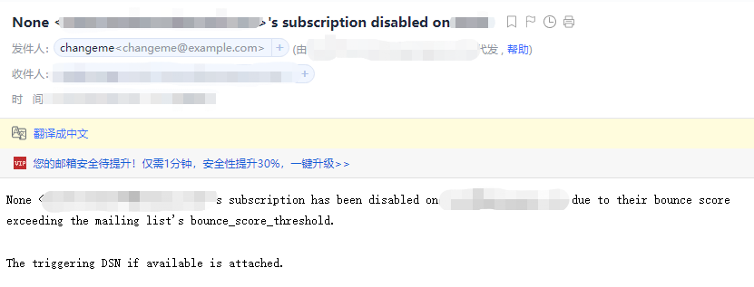

### 1.定位信息采集

1.参考用户接收到的内容，发现使用模板: list:admin:notice:disable， 确定该模板是用来通知订阅确认消息发送失败的。

2.参考exim的日志，以caozhi****@qq.com为例：

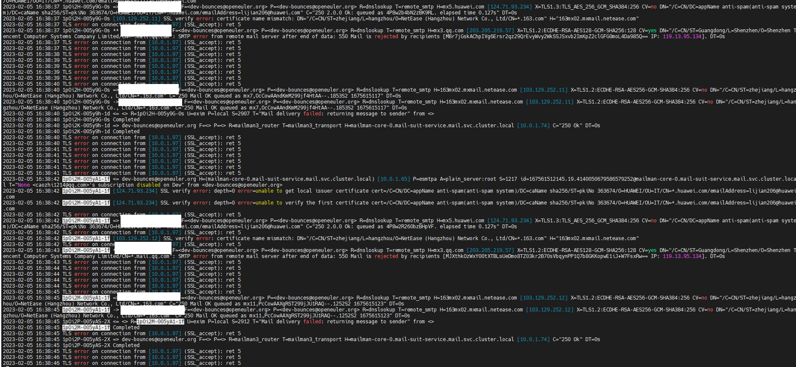

~~~bash
2023-02-07 00:38:42 exim接收到mailman-core的邮件发送请求，要求发给dev邮件列表下所有的owner， 而发给owner列表下的某一个具体的邮箱失败，导致邮件反弹到mailman-core服务中。
~~~

3.参考mailman-core服务的日志，以caozhi****@qq.com为例：

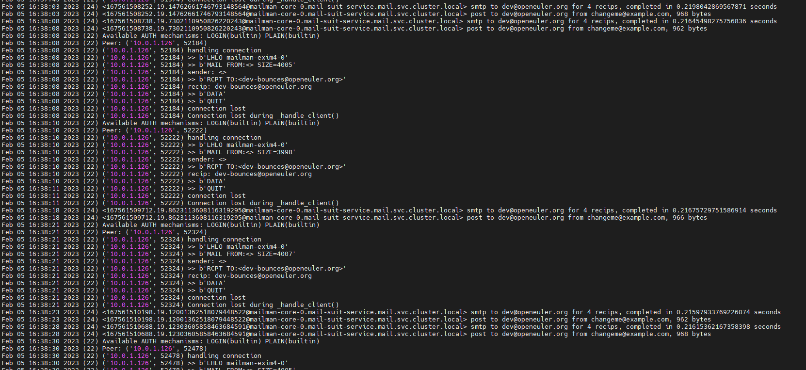

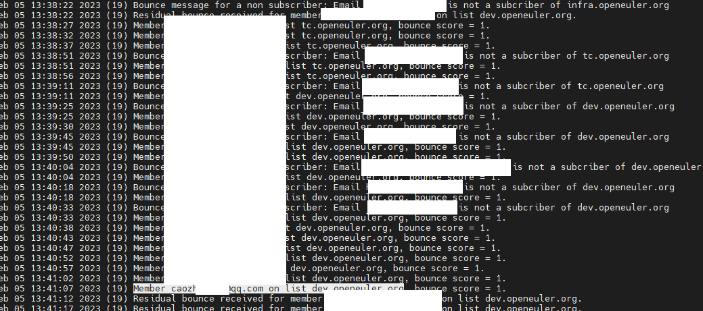

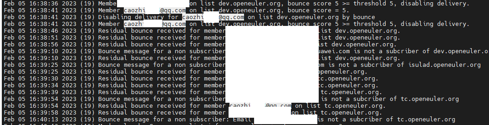

~~~bash
2月6号， 00:38发生第五次操作,图为utc时间，北京时间应该+8
~~~

### 2.分析代码

1.分析流程

bounce主流程

run._process_one_file流程

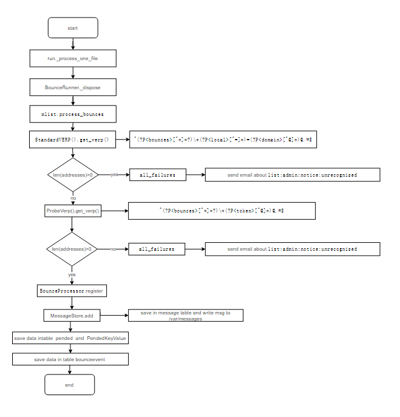

runner._do_periodic流程

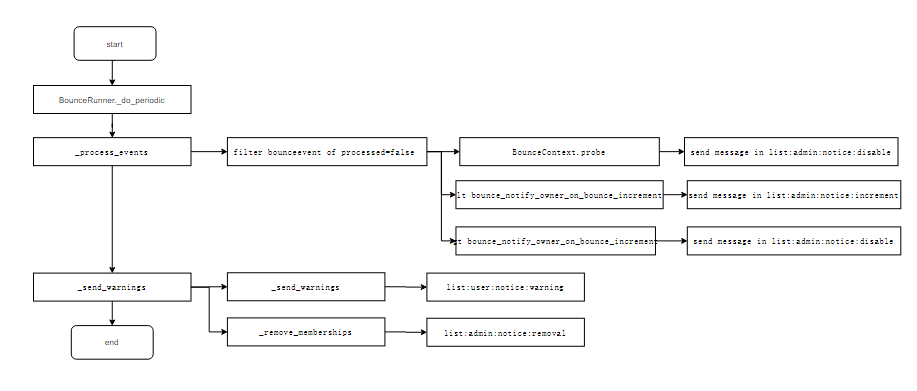

### 3.分析逻辑

1.mailman-core通过exim发送邮件失败，包括订阅邮件列表发送确认信息失败和正常的转发失败，会反馈给mailman-core服务, mailman-core的lmtp接受到邮件会将信息保存到/opt/mailman/var/queue/bounces目录下.保存内容如下：

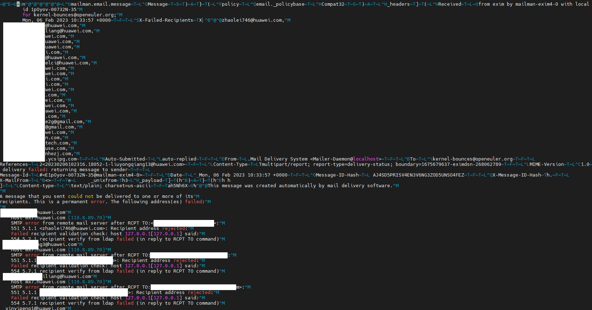

2.bounce后台进程会循环遍历/opt/mailman/var/queue/bounces的文件，通过读取文件内容，解析文件内容，将内容（主要是通过邮件列表转发的邮件失败信息和发送订阅的confirm邮件失败信息）保存到数据库对应的表中，保存到数据库中的流程主要是在`run._process_one_file`中实现；保存的信息和处理的bounceevent是隔离开的，详细的来说，保存到数据库表可以是kernel邮件列表， 但是实际上处理是针对于整个目录，而目录中不仅包含kernel这个邮件列表。

遍历所有的bounceevent下未处理(processed=false)的记录，判断失败的次数是否小于5（以邮件列表为单位进行统计），如果大于阈值bounce_score_threshold并且检测到bounce_notify_owner_on_disable为true，则进行发送邮件通知，模板内容为：list:admin:notice:disable， 这个流程主要是`runner:_do_periodic()`。

bounceevent未处理的记录如下：

### 4.定位总结

为了支持源码可控，国产化等，将openEuler社区的邮件服务进行升级处理，其中包括mailman由之前的3.2.2升级为3.3.7；Mailman core 3.3.1 是第一个实际处理退回邮件的版本。在此版本之前，退回邮件记录在bounce-event数据库的表中，但未处理。这会导致升级到 core(3.3.7) >=3.3.1 会导致处理许多旧的、陈旧的退回提醒邮件, 用owner接受到的caozhi****@qq.com为例，就是处理2020年的订阅失败的退回提醒邮件：

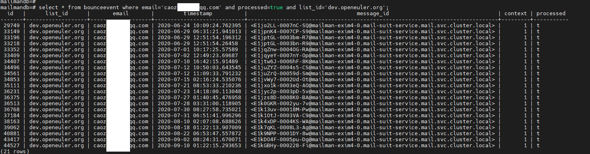

详细参考社区： https://www.mail-archive.com/mailman-developers@python.org/msg17765.html

### 5.解决方法

关闭邮件列表的的bounce提醒设置

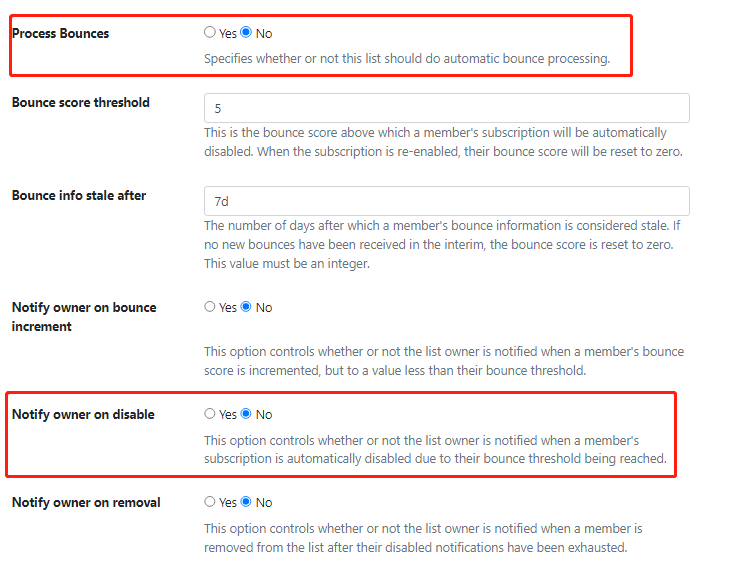

### 6.FAQ

1.是谁触发导致这个场景的？

答：mailman-core通过exim发送邮件失败，包括订阅邮件列表发送确认信息失败和正常的转发失败，会反馈给mailman-core服务，mailman-core会将服务写入到opt/mailman/var/queue/bounces, 然后bounce会异步处理文件。

2.以dev-owener为例，收到有关于caozhi****@qq.com的提醒只有一份，但是数据库的记录却是13条？

答：程序中有做防重发提示邮件的功能，详细见代码： vim mailman-core/mailman-core-3.3.7/src/mailman/model/bounce.py +124, 发送成功会保存状态member.preferences.delivery_status，下一次就不会再次发送。

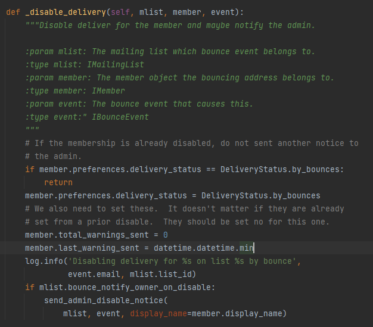

## 场景二: opengauss的user接收到提示邮件

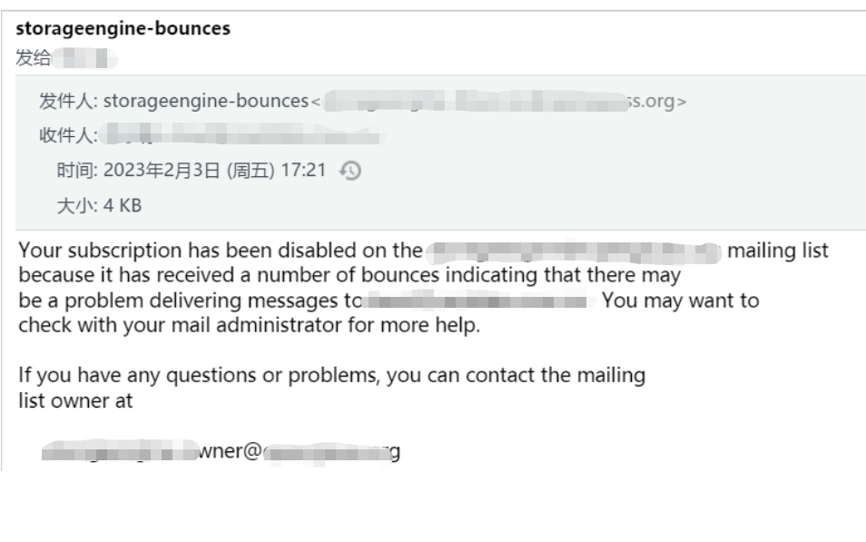

### 1.定位信息采集

1.发现模板信息是：list:user:notice:warning， 

2.查找exim的日志信息

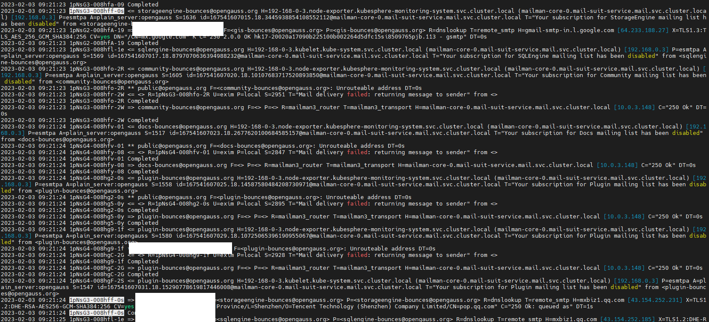

### 2.分析代码

runner._do_periodic流程

### 3.分析逻辑

在runner._do_periodic的_send_warnings流程中，会连表member， mailinglist等查出pending已经过期的成员返回发送邮件提醒。

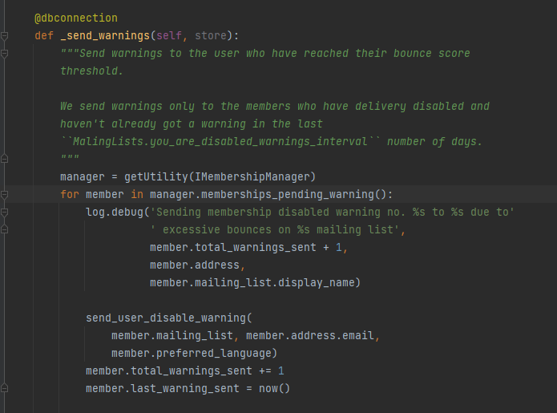

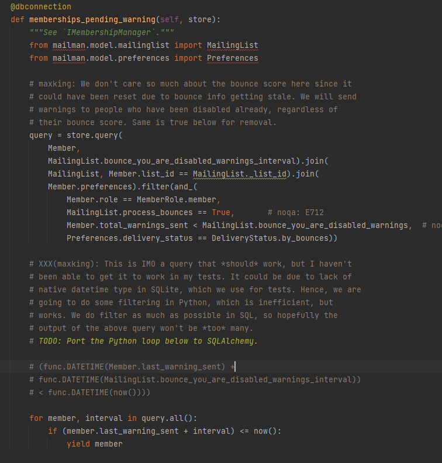

### 4.定位总结

查询数据库的记录：

为了支持源码可控，国产化等，将openEuler社区的邮件服务进行升级处理，其中包括mailman由之前的3.2.2升级为3.3.7；源码中增加pending提示信息的处理，所以会进行邮件提醒。

### 5.解决方法

因为是连表查询过滤了MailingList.process_bounces == True， 所以需要在设置中配置

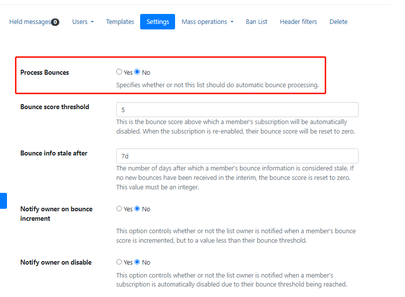

